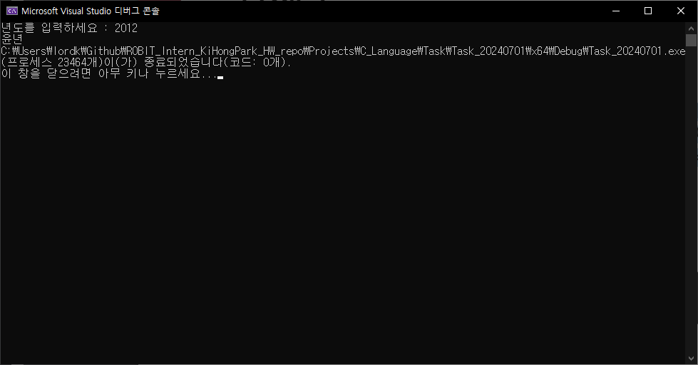
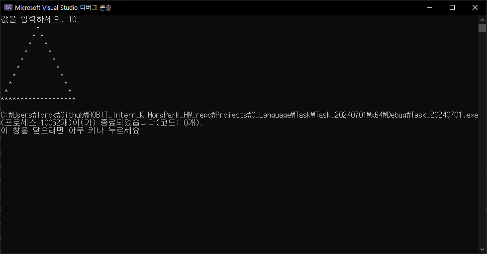

# 과제1
> [과제 설명]<br>
> 5개의 실수를 입력받아 평균과 최댓값 최솟값을 출력하는 프로그램을 작성하시오.

```C
#include <stdio.h>

int main(void) {

	// 변수 선언하기
	float num1, num2, num3, num4, num5;
	float sum, avg, max, min;
	int i, j;

	// 출력 및 입력 받기
	printf("1 번째 실수를 입력하시오. ");
	scanf_s("%f", &num1);
	printf("2 번째 실수를 입력하시오. ");
	scanf_s("%f", &num2);
	printf("3 번째 실수를 입력하시오. ");
	scanf_s("%f", &num3);
	printf("4 번째 실수를 입력하시오. ");
	scanf_s("%f", &num4);
	printf("5 번째 실수를 입력하시오. ");
	scanf_s("%f", &num5);

	// 평균 구하기
	sum = (num1 + num2 + num3 + num4 + num5);
	avg = sum / 5;

	//TODO: 최댓값 구하기
	max = num1;
	for (i = 0; i < 5; i++) {
		if (max < num1) {
			max = num1;
		}else if(max < num2){
			max = num2;
		}else if(max < num3){
			max = num3;
		}else if(max < num4){
			max = num4;
		}else if(max < num5){
			max = num5;
		}
	}

	//TODO: 최솟값 구하기
	min = num1;
	for (i = 0; i < 5; i++) {
		if (min > num1) {
			min = num1;
		}else if (min > num2) {
			min = num2;
		}else if (min > num3) {
			min = num3;
		}else if (min > num4) {
			min = num4;
		}else if (min > num5) {
			min = num5;
		}
	}

	printf("---- 결과 ----\n");
	printf("평균은 %f입니다.\n", avg);
	printf("최댓값은 %f입니다.\n", max);
	printf("최솟값은 %f입니다.", min);

	return 0;
}
```
## Test Case #1


## Test Case #2


# 과제 2
> [과제 설명]<br>
> 피보나치 수는 0과 1로 시작한다. 1번째 피보나치 수는 0이고, 2번째 피보나치 수는 1이다.
> 그 다음 3번째 부터는 바로 앞 두 피보나치 수의 합이 된다. 이를 식으로 써보면 Fn = Fn-1 + Fn-2 (n ≥ 2)가 된다.
> 피보나치 수를 나열하여 작성하면 아래와 같다.
> 0, 1, 1, 2, 3, 5, 8, 13, 21, 34, 55, 89, 144, 233, 377, 610, 987 …
> n을 입력받아, n번째 피보나치 수를 출력하는 프로그램을 작성하시오. 

```C
#include <stdio.h>

int main(void) {

	// 변수 선언하기
	int num, leftNum = 0, rightNum = 1, nowNum = 1;
	int i;

	// 형식 출력하기
	printf("n 입력 : ");
	scanf_s("%d", &num);

	printf("계산 과정 : ");
	// 피보나치 기본 수 표시
	printf("%d %d %d ", leftNum, nowNum, rightNum);

	// 피보나치 수열 구하기
	for (i = 0; i < num; i++) {
		leftNum = nowNum;
		nowNum = rightNum;
		rightNum = nowNum + leftNum;

		printf("%d ", rightNum); // 계산 과정 출력하기

	}

	printf("\nn번째 피보나치 값 : %d ", rightNum);


	return 0;
}
```

## Test Case #1


## Test Case #2


# 과제 3
> [과제 설명]<br>
> 연도가 주어졌을 때, 윤년인지 판단하는 프로그램을 작성하시오.<br><br>
> 윤년은 연도가 4의 배수이면서, 100의 배수가 아닐 때 또는 400의 배수일 때이다.
> 예를 들어, 2012년은 4의 배수이면서 100의 배수가 아니 라서 윤년이다. 1900년은 100의 배수이고 400의 배수는 아니기 때문에 윤년이 아니다. 하지만, 2000년은 400의 배수이기 때문에 윤년이다.

```C
#include <stdio.h>

int main() {

	// 변수 선언하기
	int inputYear;

	// 형식 출력하기
	printf("년도를 입력하세요 : ");

	// 값 입력받기
	scanf_s("%d", &inputYear);
	
	// 윤년 계산 및 결과값 출력하기
	if ((inputYear % 4 == 0) && (inputYear % 100 != 0) || (inputYear % 400 == 0)) {
		printf("윤년");
	}else{
		printf("윤년이 아닙니다.");
	}


	return 0;
}
```

## Test Case #1


## Test Case #2


# 과제 4
> [과제 설명]<br>
> 사칙 연산, 거듭제곱이 가능한 계산기 프로그램을 작성하시오.

```C
#define _CRT_SECURE_NO_WARNINGS
#include <stdio.h>

int main(void) {

	// 변수 선언하기
	double num1 = 0, num2 = 0, result = 1;
	char operator;
	int i;

	// 형식 출력하기
	printf("Input Arithmetic Operation\n");
	printf("ex)     3.4 * 8.5\n");
	printf("        2.9 - 5.4\n");
	printf("        3.9 * 8.0\n");
	printf("        3.9 ^ 8\n");
	printf("input : ");

	// 입력 받기
	scanf("%lf %c %lf", &num1, &operator, &num2);

	// 연산하기
	if (operator == '+') {
		result = num1 + num2;
	}else if (operator == '-') {
		result = num1 - num2;
	}else if (operator == '*') {
		result = num1 * num2;
	}else if (operator == '/') {
		// 예외 처리
		if (num2 == 0) {
			printf("0으로 나눌 수 없습니다.");
			return 0;
		}else{
			result = num1 / num2;
		}
	}else if (operator == '^') {
		for (i = 0; i < num2; i++) {
			result = result * num1;
		}
	}

	printf("%.2lf %c %.2lf = %.2lf", num1, operator, num2, result);

	return 0;
}
```

## Test Case #1


## Test Case #2


# 과제 5
> [과제 설명]<br>
> 사칙 연산, 거듭제곱이 가능한 계산기 프로그램을 작성하시오.

```C
#include <stdio.h>

int main() {

	// 변수 선언하기
	int number, i, j, k, space, cnt;

	// 형식 출력하기
	printf("값을 입력하세요.");

	// 값 입력받기
	scanf_s("%d", &number);

	// 알고리즘 구현 및 출력하기
	cnt = 1;
	space = (number * 2) - 2;
	for (i = 0; i < (number * 2); i++) {

		if (i < number) {
			for (j = 0; j < cnt; j++) {
				printf("*");
			}
			for (k = 0; k < space; k++) {
				printf(" ");
			}
			for (j = 0; j < cnt; j++) {
				printf("*");
			}
			cnt++;
			space -= 2;
			/*printf("%d %d %d", space, cnt, i);*/
		}else if(i == number) {
			space = 0;
			continue;
			/*printf("%d", i);*/
		}else if(i > number){
			cnt -= 1;
			space += 2;
			/*printf("%d %d %d", space, cnt, i);*/
			for (j = 0; j < cnt - 1; j++) {
				printf("*");
			}
			for (k = 0; k < space; k++) {
				printf(" ");
			}
			for (j = 0; j < cnt - 1; j++) {
				printf("*");
			}
		}

		printf("\n");
	}

	return 0;
}
```

## Test Case #1


## Test Case #2


# 과제 6
> [과제 설명]<br>
> 아래 예제를 통해 규칙을 유추하여, 값을 입력 받은 후 별을 출력하는 프로그램을 작성하시오.

```C
#include <stdio.h>

int main() {

	// 변수 선언하기
	int number, i, j,k, cnt;
	
	// 형식 출력하기
	printf("값을 입력하세요. ");
	scanf_s("%d", &number);

	int tempNum = number;
	int star = 1;

	// 트리 구현하는 알고리즘
	for (i = 0; i < number; i++) {
		for (k = 0; k < ((number * 2) - star) / 2; k++) {
			printf(" ");
		}
		for (j = 0; j < star; j++) {
			if ((0 < j && j < star - 1) && i != number - 1) {
				printf(" ");
			}else{
				printf("*");
			}
		}
		for (k = 0; k < number - star; k++) {
			printf(" ");
		}
		star = star + 2;
		printf("\n");
	}


	return 0;
}
```

## Test Case #1


## Test Case #2


# 과제 7
> [과제 설명]<br>
> n과 r을 입력 받아 순열, 중복 순열, 조합, 중복조합을 구하는 코드를 작성하시오.

```C
#include <stdio.h>

int main(void) {

	// 변수 선언하기
	int num1, num2, tempNum1 = 1, tempNum2 = 1, tempNum3 = 1, cntNum1 = 1, cntNum2 = 1, cntNum3 = 1;
	int result1 = 0, result2 = 0, result3 = 0, result4 = 0;
	
	//형식 출력하기
	printf("n, r 입력 : ");
	scanf_s("%d %d", &num1, &num2);


	// 순열 구하는 알고리즘
	tempNum1 = 1, tempNum2 = 1, tempNum3 = 1, cntNum1 = 1, cntNum2 = 1, cntNum3 = 1; // 초기화
	while (1) {
		// n! 구하기
		while (1) {
			if (cntNum1 <= num1) {
				tempNum1 = tempNum1 * cntNum1;
				cntNum1++;
			}else if (cntNum1 > num1) {
				break;
			}
		}
		// (n - r)! 구하기
		while (1) {
			if (cntNum2 <= num1 - num2) {
				tempNum2 = tempNum2 * cntNum2;
				cntNum2++;
			}else if (cntNum2 > num1 - num2) {
				break;
			}
		}
		break;
	}
	result1 = tempNum1 / tempNum2;

	// 중복순열 구하는 알고리즘
	tempNum1 = 1, tempNum2 = 1, tempNum3 = 1, cntNum1 = 1, cntNum2 = 1, cntNum3 = 1; // 초기화
	while (1) {
		if (cntNum1 <= num2) {
			tempNum1 = tempNum1 * num1;
			cntNum1++;
		}else if(cntNum1 > num2){
			break;
		}
	}
	result2 = tempNum1;

	// 조합 구하는 알고리즘
	tempNum1 = 1, tempNum2 = 1, tempNum3 = 1, cntNum1 = 1, cntNum2 = 1, cntNum3 = 1; // 초기화
	while (1) {
		// n! 구하기
		while (1) {
			if (cntNum1 <= num1) {
				tempNum1 = tempNum1 * cntNum1;
				cntNum1++;
			}
			else if (cntNum1 > num1) {
				break;
			}
		}

		// (n - r)! 구하기
		while (1) {
			if (cntNum2 <= num1 - num2) {
				tempNum2 = tempNum2 * cntNum2;
				cntNum2++;
			}else if (cntNum2 > num1 - num2) {
				break;
			}
		}
		// r! 구하기
		while (1) {
			if (cntNum3 <= num2) {
				tempNum3 = tempNum3 * cntNum3;
				cntNum3++;
			}else if(cntNum3 > num2){
				break;
			}
		}
		break;
	}
	result3 = tempNum1 / (tempNum2 * tempNum3);

	// 중복조합 구하는 알고리즘
	tempNum1 = 1, tempNum2 = 1, tempNum3 = 1, cntNum1 = 0, cntNum2 = 1, cntNum3 = 1; // 초기화
	while (1) {
		// (n + r - 1) 구하기
		while (1) {
			if (cntNum1 < num2) {
				tempNum1 = tempNum1 * ((num1 + num2 - 1) - cntNum1);
				cntNum1++;
			}else if (cntNum1 >= num2) {
				break;
			}
		}

		// r! 구하기
		while (1) {
			if (cntNum3 <= num2) {
				tempNum3 = tempNum3 * cntNum3;
				cntNum3++;
			}else if (cntNum3 > num2) {
				break;
			}
		}
		break;
	}
	result4 = tempNum1 / tempNum3;


	printf("순열 결과 %d\n중복순열 결과 : %d\n조합 결과 : %d\n중복조합 결과 : %d\n", result1, result2, result3, result4);


}
```

## Test Case #1


## Test Case #2
