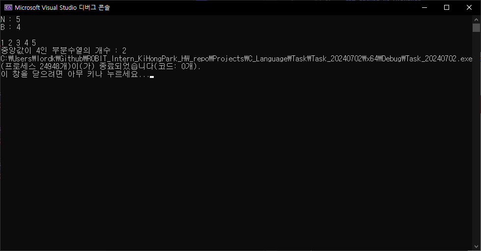

# 과제1
> [과제 설명]<br>
> 입력받은 종류와 숫자를 이용하여 별을출력하는 프로그램<br>
> (조건 : 함수를 이용하여 작성하시오)<br>
> 입력1 : 길이<br>
> 입력2 : 종류<br>

```C
#define _CRT_SECURE_NO_WARNINGS
#include <stdio.h>

void DrawingStar_Type1(int sizeGuide);
void DrawingStar_Type2(int sizeGuide);
void DrawingStar_Type3(int sizeGuide);
void DrawingStar_Type4(int sizeGuide);

int main() {

	// 변수 선언하기
	int size, type;

	printf("사이즈와 종류를 입력하시오.");
	// 선배님께서 말씀하신 입력 조건 : size = 홀수만, max : 9
	scanf("%d %d", &size, &type);

	switch (type)
	{
	case 1:
		DrawingStar_Type1(size);
		break;
	case 2:
		DrawingStar_Type2(size);
		break;
	case 3:
		DrawingStar_Type3(size);
		break;
	case 4:
		DrawingStar_Type4(size);
		break;
	default:
		break;
	}

	return 0;
}

// 종류 1 출력하는 알고리즘
void DrawingStar_Type1(int sizeGuide) {

	int i, j;
	for (i = 0; i < sizeGuide; i++) {
		for (j = 0; j <=i; j++) {
			if (j <= i && j < sizeGuide - i) {
				printf("*");
			}else{
				printf(" ");
			}
		}
		printf("\n");
	}
}


// 종류2 출력하는 알고리즘
void DrawingStar_Type2(int sizeGuide) {

	int i, j;
	for (i = 0; i < sizeGuide; i++) {
		for (j = 0; j < sizeGuide - 2; j++) {
			if (j < sizeGuide - 3 - i || j <= i- 3) {
				printf(" ");
			}else {
				printf("*");
			}
		}
		printf("\n");
	}
}

// 종류3 출력하는 알고리즘
void DrawingStar_Type3(int sizeGuide) {

	int i, j;
	for (i = 0; i < sizeGuide; i++) {
		for (j = 0; j < sizeGuide; j++) {
			if ((i <= j && j < sizeGuide - i) || i >= j && (sizeGuide - (i + 1) <= j)) {
				printf("*");
			}else {
				printf(" ");
			}
		}
		printf("\n");
	}
}

// 종류4 출력하는 알고리즘
void DrawingStar_Type4(int sizeGuide) {

	int i, j;
	for (i = 0; i < sizeGuide; i++) {
		for (j = 0; j < sizeGuide; j++) {
			if ((j >= i && j <= (sizeGuide - 1) / 2) || i > ((sizeGuide - 1) / 2) && ((j >= (sizeGuide - 1) /2) && j <= i)) {
				printf("*");
			}else{
				printf(" ");
			}
		}
		printf("\n");
	}
}
```
## Test Case #1


## Test Case #2


## Test Case #3


# 과제 2
> [과제 설명]<br>
> 선택정렬<br>
> 정렬이 안된 숫자들 중에서 최대값을 선택하여 배열의 마지막 값과 교환하는 방식<br>
> 임의의수를입력받아배열에저장하고,저장된배열안의수를정렬하는프로그램을작성하시오.<br>
> (입력은 정수8개로 제한, 정렬이되는중간과정출력)

```C
#define _CRT_SECURE_NO_WARNINGS
#include <stdio.h>

int main() {
	
	// 변수 선언하기
	int numAry[8] = { 0, };
	int i, j, k;
	int maxNum = 0, aryIndex = 7;

	printf("입력\n");

	for (i = 0; i < 8; i++) {
		printf("%d : ", i);
		scanf("%d", &numAry[i]);
	}

	// 과정 출력 (정렬 전)
	printf("\n계산 과정\n");
	for (k = 0; k < 8; k++) {
		printf("%d ", numAry[k]);
	}
	printf("\n");

	// 최댓값 선택하기
	for (i = 7; i >= 0; i--) {
		maxNum = numAry[i]; // 최댓값 임시 지정
		
		// 다른 수 비교하기
		for (j = i - 1; j >= 0; j--) {
			if (maxNum < numAry[j]) {
				// 최댓값 지정하기
				maxNum = numAry[j];

				// 최댓값 인덱스 위치 변경하기
				int tempNum1 = 0;
				int tempNum2 = 0;

				tempNum1 = numAry[j];
				tempNum2 = numAry[aryIndex];
				numAry[aryIndex] = tempNum1;
				numAry[j] = tempNum2;
			}
		}
		aryIndex--;

		for (k = 0; k < 8; k++) {
			printf("%d ", numAry[k]);
		}
		printf("\n");

	}

	// 결과 출력 (정렬 정리)
	printf("\n출력\n");
	for (k = 0; k < 8; k++) {
		printf(" %2d : %2d\n", k, numAry[k]);
	}

	return 0;
}
```

## Test Case #1


## Test Case #2


## Test Case #3


# 과제 3

```C
#define _CRT_SECURE_NO_WARNINGS
#include <stdio.h>

int CheckingScale(char inputString[8]);

int main() {

	// 변수 선언하기
	char userInput[8] = { ' ', };
	int i;

	// 형식 출력하기
	printf("음 입력\n");
	for (i = 0; i < 8; i++) {
		scanf("%c", &userInput[i]);
	}
	
	switch (CheckingScale(userInput))
	{
	case 1:
		printf("결과 : ascending\n");
		break;
	case 2:
		printf("결과 : descending\n");
		break;
	case 3:
		printf("결과 : mixed\n");
		break;
	default:
		break;
	}	

	return 0;
}

int CheckingScale(char inputString[8]) {
	// 변수 선언하기
	char stringAscending[8] = "cdefgabC";
	char stringDescending[8] = "Cbagfedc";
	int i, j, cntScale1 = 0, cntScale2 = 0; // cntScale : Scle 체크 변수

	for (i = 0; i < 8; i++) {
		if (inputString[i] == stringAscending[i]) {
			cntScale1++;
		}else if(inputString[i] == stringDescending[i]){
			cntScale2++;
		}
	}

	if (cntScale1 == 8) {
		return 1;
	}else if (cntScale2 == 8) {
		return 2;
	}else{
		return 3;
	}
}
```

## Test Case #1


## Test Case #2


## Test Case #3


# 도전 과제 4

```C
#define _CRT_SECURE_NO_WARNINGS
#include <stdio.h>

int main() {

	// 변수 선언하기
	int sequenceSize, middleNum, cnt = 1;
	/*
	* 변수 cnt의 초기값을 1로 설정하는 이유:
	* 중복 수열의 특징에 따라 타겟 값(middleNum)도 포함해야 하기 때문이다.
	*/
	// 배열 sequence는 동적할당 하지 않고 구현함.
	int i, sequence[100] = { 0, };
	
	// 형식 출력하기
	printf("N : ");
	scanf("%d", &sequenceSize);
	printf("B : ");
	scanf("%d", &middleNum);

	printf("\n");

	// 알고리즘 구현하기
	// 수열에 값 입력 받기
	for (i = 0; i < sequenceSize; i++) {
		scanf("%d", &sequence[i]);
	}

	// 중복수열 구하는 알고리즘
	for (i = 0; i < sequenceSize; i++) {
		if (sequence[i] == middleNum || sequence[sequenceSize - i - 1] == middleNum) {
			break;
		}else{
			sequence[i] = 0;
			sequence[sequenceSize - i - 1] = 0;
			cnt++;
		}
	}

	// 결과 출력하기
	printf("중앙값이 %d인 부분수열의 개수 : %d", middleNum, cnt);

	return 0;
}
```

## Test Case #1


## Test Case #2


## Test Case #3


