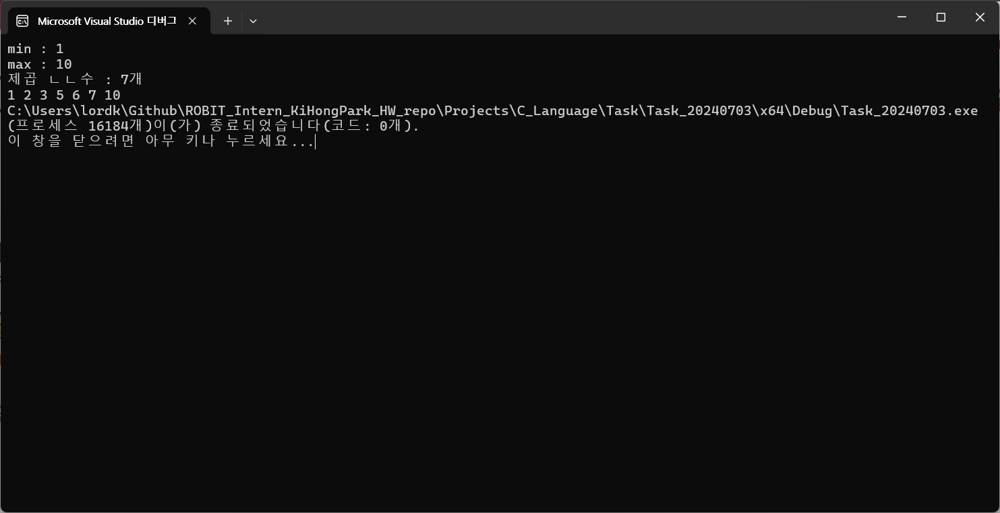
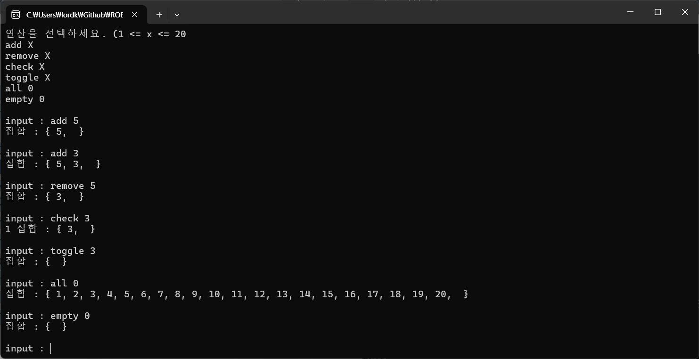
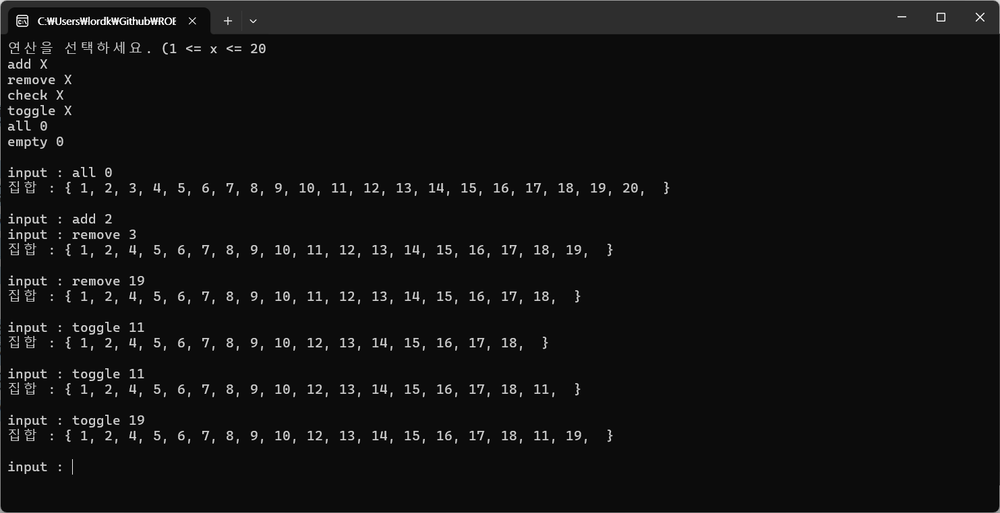
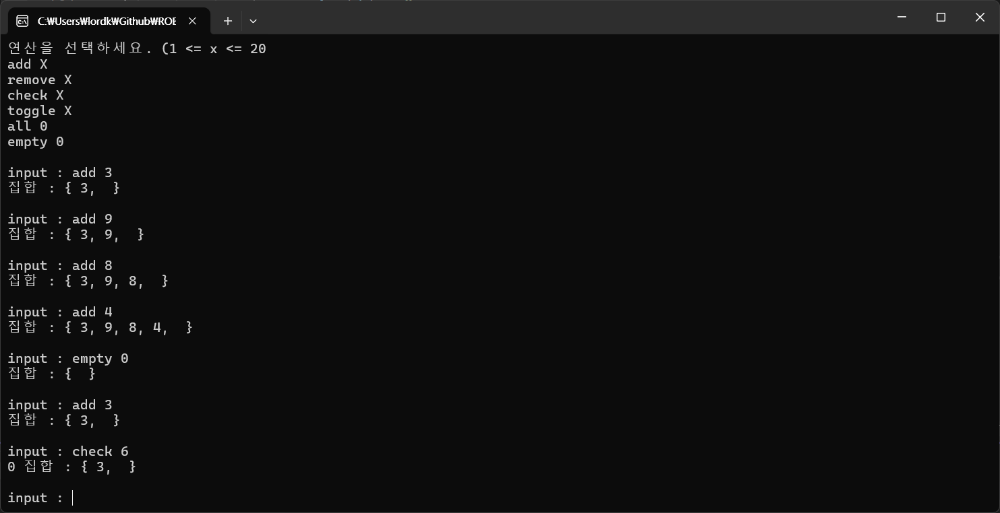

# 과제1
> [과제 설명]<br>
> 어떤 수 X가 1보다 큰 제곱수로 나누어 떨어지지 않을 때, 제곱ㄴㄴ수라고 한다.
> 제곱수는 4, 9, 16, 25와 같은 것이고, 제곱ㄴㄴ수는 1,2,3,5,6,7,10,11,13,...과 같은 수이다.
> min과 max가 주어지면, min과 max를 포함한 사이에 제곱ㄴㄴ수가 몇 개 있는지 출력한다.
> 입력은 정수 1 ~ 10000사이로 한다.

```C
#define _CRT_SECURE_NO_WARNINGS
#include <stdio.h>

int main() {

	// 변수 선언하기.
	int min = 0, max = 0, squareCnt = 0;
	// 제곱 ㄴㄴ수를 담는 배열.
	int squareNumAry[10000] = { 0, };
	int i, j, isSquare = 0;

	// 형식 출력하기.
	printf("%min : ");
	scanf("%d", &min);
	printf("%max : ");
	scanf("%d", &max);

	// 제곱 ㄴㄴ수 구하기
	/*
	* 추정하는 공식 : (어떤 수 X) % (제곱 수) != 0->제곱 ㄴㄴ수.
	* 어떤 수 X : min이상 ~ max 이하의 모든 수.
	* 제곱 수 : 4, 9, 16 ~~~.
	*/ 

	for (i = min; i <= max; i++) {
		// 임의의 제곱 수 선언
		int tempSquareNum = 0;
		for (j = 2; j < 10000; j++) {
			tempSquareNum = j * j;
			// 제곱 ㄴㄴ수가 아니라면
			if (i % tempSquareNum == 0) {
				isSquare = 0;
				break;
			}else{
				isSquare = 1;
			}
			// 제곱 수 증가 공식
		}
		if (isSquare == 1) {
			squareNumAry[squareCnt] = i;
			// 제곱 ㄴㄴ수가 배열에 포함되면 해당 배열의 index 값 증가시키기.
			squareCnt++;
		}
		isSquare = 0;
	}


	printf("제곱 ㄴㄴ수 : %d개\n", squareCnt);


	// 제곱 ㄴㄴ수가 담긴 배열을 출력하기
	for (i = 0; i < 10000; i++) {
		if (squareNumAry[i] == 0) {
			break;
		}else{
			printf("%d ", squareNumAry[i]);
		}
	}

	return 0;
}
```
## Test Case #1


## Test Case #2


## Test Case #3


# 과제 2
> [과제 설명]<br>
> 비어있는 공집합 S가 주어졌을 때, 아래 연산을 수행하는 프로그램을 작성하시오.
> • add x: S에 x를 추가한다. (1 ≤ x ≤ 20) S에 x가 이미 있는 경우에는 연산을 무시한다.
> • remove x: S에서 x를 제거한다. (1 ≤ x ≤ 20) S에 x가 없는 경우에는 연산을 무시한다.
> • check x: S에 x가 있으면 1을, 없으면 0을 출력한다.
> • toggle x: S에 x가 있으면 x를 제거하고, 없으면 x를 추가한다. (1 ≤ x ≤ 20)
> • all 0: S를 {1, 2, ..., 20} 으로 바꾼다.
> • empty 0 : S를 공집합으로 바꾼다.

```C
#define _CRT_SECURE_NO_WARNINGS
#include <string.h>
#include <stdio.h>

int main() {

	// 변수 선언하기
	int inputNum = 0, numAry[20] = { 0, }; // numAry : 요소를 저장하는 집합(배열)
	char operator[10] = { 0, }; // add, remove 등의 단어 저장 배열
	int i, j, aryIndex = 0;
	int isOkayAdd = 1, isOkayRemove = 0, isOkayCheck = 0, isOkayToggle = 0; // boolean 연산자는 안 배운 내용이므로 int로 boolean 역할을 대체함.

	// 형식 출력하기
	printf("연산을 선택하세요. (1 <= x <= 20");
	printf("\nadd X\nremove X\ncheck X\ntoggle X\nall 0\nempty 0\n\n");

	while (1) {
		
		printf("input : ");
		scanf("%s %d", &operator, &inputNum);

		/* (예외처리)
		* 과제에는 언제까지 반복하는지, 언제 탈출하는지에 대한 설명이 안 되어 있음.
		* 무한 루프를 방지하기 위해 반복문 탈출에 대한 예외처리는 임의로 구현함.
		* 단, 과제에 제시된 출력 형식을 준수하기 위해 형식 출력에서는 stop 관련 문구를 추가하지 않음.
		* 물론, Ctrl + C 단축키를 통해 무한 루프를 탈출할 수 있음.
		*/ 

		if (!strcmp(operator, "stop") && inputNum == 0) {
			printf("Stopped!");
			break;
		}

		// 계산 연산자 비교하기
		if (!strcmp(operator, "add")) {
			for (i = 0; i < 20; i++) {
				if (numAry[i] == inputNum) {
					isOkayAdd = 0;
					break;
				}
			}
			if (isOkayAdd == 1) {
				numAry[aryIndex] = inputNum;
				printf("집합 : { ");
				for (j = 0; j <= aryIndex; j++) {
					printf("%d, ", numAry[j]);
				}
				printf(" }\n\n");
				aryIndex++;
			}
			isOkayAdd = 1;
		}else if (!strcmp(operator, "remove")) {
			int removeIdx = 0; // 삭제할 요소의 index 값

			// 삭제할 수 있는 숫자인지 검토하기. (해당 숫자가 집합의 요소로 포함되어 있는지 검토)
			for (i = 0; i < 20; i++) {
				// 숫자아 집합 내에 있는 요소일 때의 처리.
				if (numAry[i] == inputNum) {
					removeIdx = i;
					aryIndex--; // 요소를 추가할 때, 변경된 index 업데이트하기
					/* ex) remove가 두 번 되었으면,
					*  추가할 때의 index 위치도 추가할 때의 index에서 두 번 뒤에서 추가해야 함.
					*/
					isOkayRemove = 1;
					break;
				}
			}
			if (isOkayRemove == 1) {
				// 요소 제거하기.
				numAry[removeIdx] = 0;
				// 제거된 요소 뒤에 있는 요소들도 앞으로 이동 시키기.
				for (j = removeIdx; j < 20; j++) {
					numAry[j] = numAry[j + 1];
				}
			}
			// 디버깅 (요소 출력하기 - 정리 후)
			printf("집합 : { ");
			for (j = 0; j < aryIndex; j++) {
				printf("%d, ", numAry[j]);
			}
			printf(" }\n\n");
			isOkayRemove = 0;
			
		}else if (!strcmp(operator, "check")) {
			// 입력된 숫자가 집합에 포함되어 있는지 검토하기
			for (i = 0; i < 20; i++) {
				if (numAry[i] == inputNum) {
					isOkayCheck = 1;
					break;
				}else{
					isOkayCheck = 0;
				}
			}
			// 만약, 집합 내에 해당 숫자가 없으면 0을 출력하기.
			// 배운 개념 중 하나인 *3항 연산자* 사용해 보기.
			printf("%d ", isOkayCheck == 1 ? 1 : 0);

			printf("집합 : { ");
			for (j = 0; j < aryIndex; j++) {
				printf("%d, ", numAry[j]);
			}
			printf(" }\n\n");

		}else if (!strcmp(operator, "toggle")) {
			int removeIdx = 0;
			// 입력된 숫자가 집합에 포함되어 있는지 검토하기
			for (i = 0; i < 20; i++) {
				if (numAry[i] == inputNum) {
					removeIdx = i;
					isOkayToggle = 1;
					break;
				}else {
					isOkayToggle = 0;
				}
			}
			// 만약 집합에 해당 숫자가 있을 때,
			if (isOkayToggle == 1) {
				// 요소 제거하기.
				numAry[removeIdx] = 0;
				aryIndex--;
				// 제거된 요소 뒤에 있는 요소들도 앞으로 이동 시키기.
				for (j = removeIdx; j < 20; j++) {
					numAry[j] = numAry[j + 1];
				}
			}else{ // 만약 집합에 해당 숫자가 없을 때,
				numAry[aryIndex] = inputNum;
				aryIndex++;
			}

			printf("집합 : { ");
			for (j = 0; j < aryIndex; j++) {
				printf("%d, ", numAry[j]);
			}
			printf(" }\n\n");

		}else if (!strcmp(operator, "all") && inputNum == 0) {
			// 과제에 제시된 입력 형식 "all 0"이 되어야만 제시된 집합으로 변경되도록 구현함.

			for (j = 0; j < 20; j++) {
				numAry[j] = j + 1;
			}

			printf("집합 : { ");
			for (j = 0; j < 20; j++) {
				printf("%d, ", numAry[j]);
			}
			printf(" }\n\n");
			aryIndex = 19;

		}else if (!strcmp(operator, "empty") && inputNum == 0) {
			// 과제에 제시된 입력 형식 "empty 0"이 되어야만 제시된 집합으로 변경되도록 구현함.
			
			/*
			* 요소는 0로 지정하여 공집합 처리를 함.
			* 0으로 지정한 이유 : 입력된 숫자의 범위는 1이상 ~ 20이하임.
			* 집합 검산 식에서 0인 요소가 있으면 공집합임을 인식하게 하여, 
			* 공집합 출력을 하도록 구현함.
			*/

			for (j = 0; j < 20; j++) {
				numAry[j] = 0;
			}

			printf("집합 : { ");
			for (j = 0; j < aryIndex; j++) {
				// 공집합이라면
				if (numAry[j] == 0) {
					break;
				}
			}
			printf(" }\n\n");
			aryIndex = 0;
		}
	}


	return 0;
}
```

## Test Case #1


## Test Case #2


## Test Case #3
